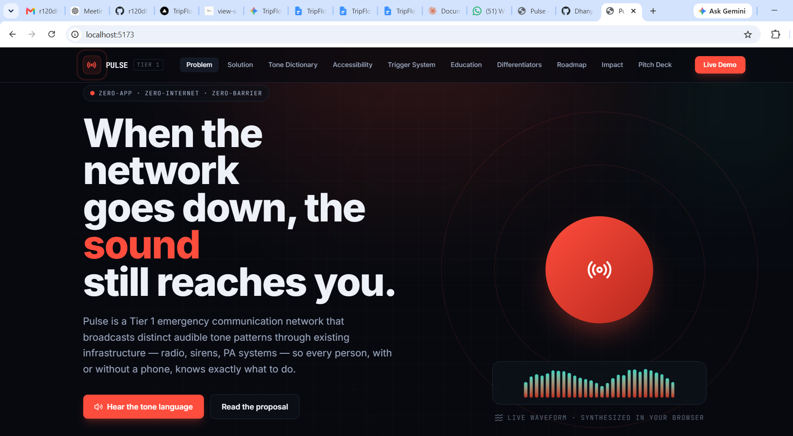
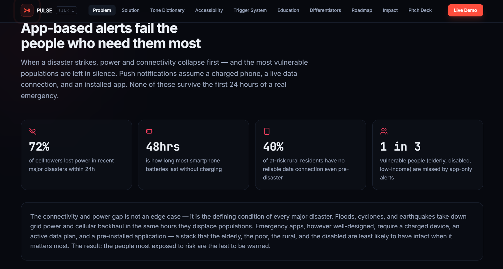
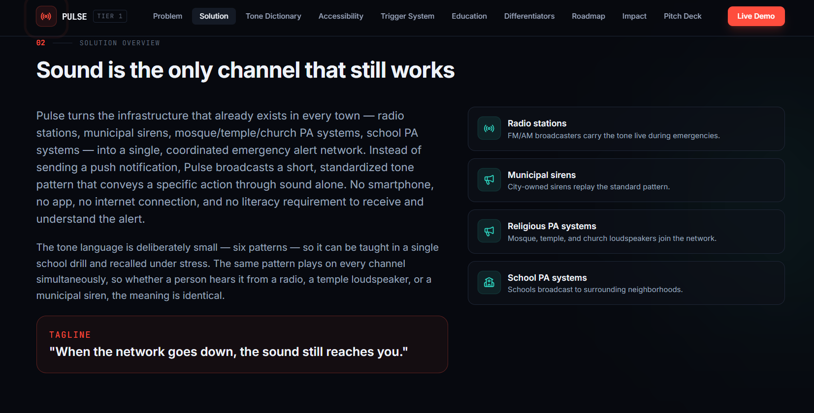
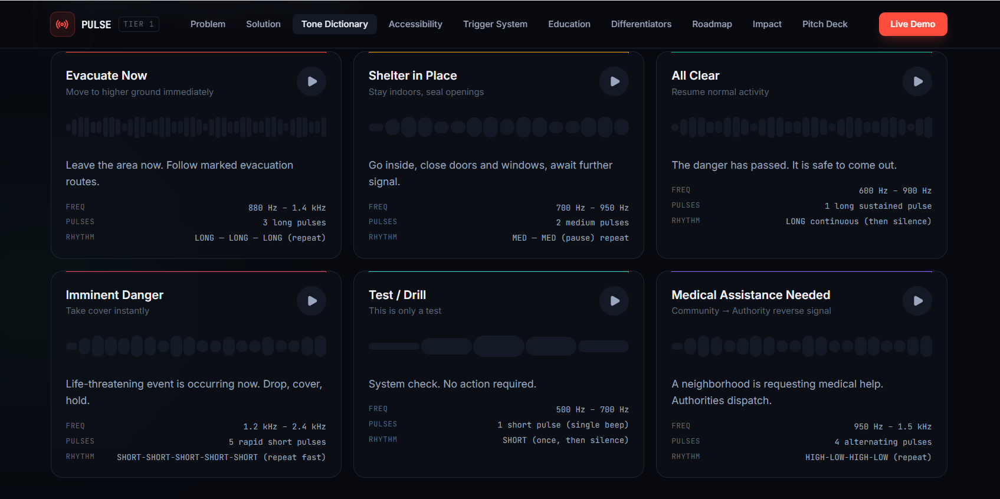
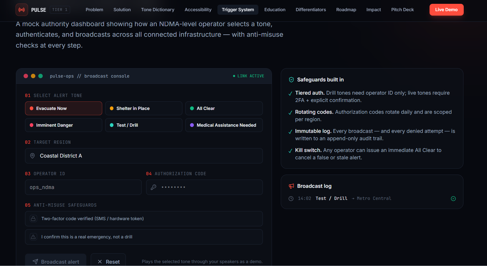

🔊 PULSE — Tier 1 Emergency Communication Network

When the network goes down, the sound still reaches you.

Emergency Communication / Disaster Management Project
Pulse is a sound-first emergency communication system designed for situations where conventional communication systems such as mobile networks and internet connectivity may fail.

Instead of depending completely on smartphones, apps, or internet connectivity, Pulse uses standardized emergency sound patterns that can be broadcast through existing infrastructure such as FM radio, municipal sirens, school PA systems, and community/religious public-address systems.

The goal is simple:

Make sure critical emergency instructions can still reach people when digital connectivity fails.

🚨 Problem

During natural disasters such as earthquakes, floods, and cyclones, power and communication infrastructure can become unavailable or overloaded.

Most modern emergency applications depend on:

📱 A smartphone
🌐 Internet or mobile connectivity
🔋 Sufficient battery
📲 An installed application
👤 A user who knows how to use the application

When these conditions fail, vulnerable people may not receive important warnings.

The question Pulse asks:

What if emergency communication did not depend on the internet?

💡 Our Solution

Pulse creates a simple emergency sound language.

Instead of sending only a notification, the system broadcasts a recognizable sound pattern representing a specific emergency action.

For example:

3 long pulses → Evacuate Now

2 medium pulses → Shelter in Place

1 long continuous pulse → All Clear

These standardized tones can be broadcast through:

📻 FM / AM radio
🚨 Municipal sirens
🏫 School PA systems
📢 Community public-address systems
🛕 Religious institution PA systems

🔊 Tone Dictionary

Pulse uses a small set of distinct sound patterns so that people can learn and recognize them quickly.

Alert	Meaning	Action
🚨 Evacuate Now	Immediate evacuation	Leave the area and follow evacuation routes
🏠 Shelter in Place	Stay indoors	Close doors/windows and wait for further instructions
🟢 All Clear	Danger has passed	Resume normal activity
⚠️ Imminent Danger	Immediate life-threatening danger	Take cover instantly
🧪 Test / Drill	System test	No action required
🏥 Medical Assistance	Medical help required	Authorities dispatch assistance

The tones are differentiated using pitch, rhythm, number of pulses, speed, and repetition, making them easier to distinguish under stressful conditions.

📡 How Pulse Works

The basic communication flow is:

Emergency Authority
        ↓
   Pulse Console
        ↓
 ┌──────┼─────────┐
 ↓      ↓         ↓
Radio  Sirens    PA Systems
 └──────┼─────────┘
        ↓
      People

An authorized emergency operator selects an alert and broadcasts it through the connected infrastructure.

The current project is an interactive prototype demonstrating this workflow.

🖥️ Live Demo

The prototype demonstrates:

🔊 Emergency tone generation
🚨 Multiple alert types
📡 Emergency broadcast workflow
🔐 Authorization and anti-misuse safeguards
♿ Accessibility concepts
🌙 Responsive interface with dark mode
📊 Emergency broadcast log

The tones are synthesized directly in the browser for demonstration purposes.

♿ Accessibility

Pulse is designed with accessibility in mind.

The complete system can provide the same alert through multiple forms:

🔊 Sound patterns
💡 Visual/strobe alerts
📳 Optional vibration wearables
📺 TV emergency crawls
🔺 Color and shape-based indicators

The vibration component is proposed as an additional hardware accessibility layer, where a pre-distributed wearable or local receiver converts the emergency alert into a recognizable vibration pattern.

🔐 Broadcast Safety

Emergency alerts must not be easy to misuse.

The proposed Pulse broadcast console includes:

Two-factor authentication
Operator identification
Region-based authorization
Emergency confirmation
Rotating authorization codes
Immutable broadcast logs
Emergency All Clear / cancellation mechanism

🌟 What Makes Pulse Different?

Traditional emergency applications often depend on:

Internet + Smartphone + App + Battery

Pulse focuses on:

Sound + Existing Infrastructure + Simple Human Recognition

It is designed as a resilient baseline communication layer, rather than a replacement for existing digital emergency systems.

🚀 Future Scope

A future Tier 2 digital layer can extend Pulse with richer information while keeping the basic Tier 1 system independent of it.

Possible enhancements include:

🗺️ Shelter and danger-zone maps
💧 Water distribution locations
🏥 Medical camp information
📱 Digital emergency alerts
🆘 Phone-to-phone distress signaling
📍 Location-based emergency information
📻 Richer data transmission through compatible radio/audio systems

The key principle remains:

Advanced technology can enhance Pulse, but the basic emergency alert should not depend on it.

🛠️ Technology
React
Tailwind CSS
Framer Motion / CSS Animations
Web Audio API
JavaScript
Mock data and simulations

The current implementation is a frontend prototype and demonstration system; real-world deployment would require integration with broadcasters, emergency authorities, siren infrastructure, and dedicated accessibility hardware.

❤️ Our Vision

When technology fails, communication shouldn't.

Pulse aims to create an emergency communication layer that remains understandable and useful even when conventional networks are unavailable.

When the network goes down, the sound still reaches you.

## 🖥️ Project Screenshots

### Landing Page

### Problem

### Solution

### Tone Dictionary

### Broadcast Console
